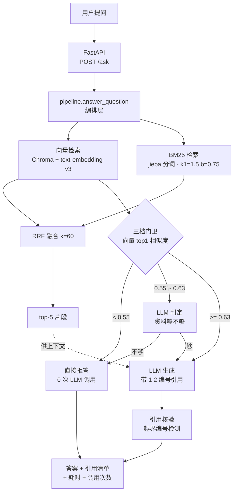

# proj1-kb-agent · 企业内部知识库智能问答

> 面向企业制度文档的 RAG 问答系统：**混合检索（BM25 + 向量）+ RRF 融合 + 三档拒答 + 引用溯源**。
> 语料 34 份内部文档 / 214 个知识块，自建 50 题评测集上块级 hit@5 达 **100%**（纯向量）/ **93.3%**（纯 BM25）/ **97.8%**（RRF 融合），
> 拒答端到端 **50/50**、可答问题误拒 **0/45**。

<!-- ✍️ 以上简介里的 3 个数字（34 / 214 / 50）不建议改，它们是这个项目最硬的部分。
     如果要说人话，就改这一句：把这个系统"像什么"用一个比喻讲出来（比如"给公司所有制度文档装了一个不会瞎编的图书管理员"）。 -->

---

## 这个项目解决什么问题

<!-- ✍️ 这一节必须你自己写。下面 3 句是可用的骨架，把它改成你自己的说法（换词、换顺序、加一个你真实遇到过的场景）。
     面试官一定会问"你为什么要做这个"，答案就出在这里。 -->

企业内部制度文档又多又散（考勤、报销、差旅、IT、保密……），员工查一条规定要翻好几份文件，而且不同文件之间还会有版本差异。

直接把文档丢给大模型让它回答，最大的问题不是答不出来，而是**它会编** —— 编一个看起来很合理的报销比例，员工照着做就出事。所以这个项目只做三件事：

1. **检索** —— 先用「向量 + BM25」两路混合检索，再把最相关的片段交给模型，而不是把整库塞进 prompt。
2. **拒答** —— 资料里确实没有的，明确说"知识库未找到相关信息"，不猜、不圆场。
3. **溯源** —— 每句结论后面都带 `[1]` `[2]` 编号，能对到"哪份文件的哪一节"，并可点开原文核对。

<!-- ✍️ 技术点补充（可选，写一句你自己最得意的设计决定）：
     为什么"检索 + 拒答 + 溯源"这三件事是一个整体？你可以从"RAG 的三大失败模式"角度写。 -->

---

## 效果（实测数字，非估算）

全部数字来自仓库内的评测脚本与评测报告：`notes/d23_eval_report.md`、`notes/d24_guard_report.md`，
可用 `python -m scripts.evaluate` 与 `python scripts/eval_guard.py --online` 复现。
评测集：`eval/questions.json`，50 题（45 题可答 + 5 题库外），gold 标注到 **chunk_id**（块级）。

### 检索质量 · 块级 hit@5 / MRR

| 方案 | hit@5（块级） | MRR |
|---|---|---|
| 纯向量检索（Chroma + text-embedding-v3） | **100%**（45/45） | 0.985 |
| 纯 BM25（jieba，k1=1.5 / b=0.75） | 93.3%（42/45） | 0.839 |
| **RRF 融合（1:1，k=60）** | **97.8%**（44/45） | 0.924 |

> 口径说明：候选池 pool=20，取 top-5，判定粒度为**块级**（先按文档级判定时三路 hit@5 全是 100%，指标饱和、没有区分度，才改成块级 —— 见"踩坑记录"第 5 条）。

### 拒答门卫 · 三档路由（HARD_REFUSE=0.55 / PASS=0.63）

| 指标 | 结果 |
|---|---|
| 库外问题拦截 | **5 / 5** |
| 可答问题误拒 | **0 / 45** |
| 端到端准确率 | **50 / 50** |
| 灰区触发次数 | 4 / 50（仅这 4 题多花 1 次 LLM 调用） |

### 阈值扫描（为什么最终定 0.55 和 0.63）

| 阈值 | 拦下库外 | 误杀可答 |
|---|---|---|
| 0.55 | 2 / 5 | **0 / 45** |
| 0.63 | **5 / 5** | 1 / 45 |
| 0.70 | 5 / 5 | 6 / 45 |

→ 单阈值做不到"全拦 + 零误杀"（0.63 能全拦但误杀 1 题，0.55 零误杀但只拦住 2 题），**这才是引入灰区 LLM 判定的原因**，不是拍脑袋加的一层。

---

## 架构



**三条设计主线**：接口层与业务层分离（`app.py` / `pipeline.py`）；两路检索汇入 RRF，参数写死在代码里；门卫只在**检索层**用向量 top1 相似度做决策，低于硬拒线时 **0 次 LLM 调用**，这是成本优化。

---

## 核心技术点

<!-- ✍️ 这一节要你自己写。下面 3 个点是最该讲的，每个写 2~4 句就够了，别写成长篇。
     提示：面试官会追问"为什么"，所以每点都要有"我试了 A、发现 B、所以选 C"这个结构。 -->

### 1. 为什么用 RRF，而不是加权分数相加

向量检索给的是余弦相似度（0~1 有界），BM25 给的是无上界的词频分（实测可到 8~18 分），**两种分数根本不在一个量纲上**，直接加权相加等于让 BM25 单方面主导。RRF 只看"排名"不看"分数"，天然绕开了尺规问题：

```
score(d) = Σ 1 / (k + rank_i(d))
```

`k=60` 是经验值（抑制"第一名独大"），实测 k=10 / k=60 结果一致，所以保留 60。

### 2. 三档拒答为什么这么切

单阈值实测做不到"库外全拦 + 可答零误杀"（见上表），所以改成三档：

- `< 0.55` **硬拒** —— 零误杀区间，直接拒，不花钱；
- `0.55 ~ 0.63` **灰区** —— 让 LLM 读一遍检索到的片段判断"这些资料够不够回答"，实测 4/4 全对；
- `>= 0.63` **放行** —— 直接生成。

代价是 50 题里只多花 4 次 LLM 调用，换来端到端 50/50。

### 3. 引用核验（防幻觉引用）

生成完不算完，还要过一道质检：`check_citations()` 检查答案里出现的 `[N]` 编号是否越界（比如只检索了 5 条却引用 `[7]`）、以及是否一个引用都没标。返回 `{'used': [...], 'invalid': [...], 'coverage': bool}`，接口把这份"质检回执"一并返回，前端可以直接提示"本次答案引用无效"。

---

## 快速开始

### 1. 环境要求

- Python 3.12
- 两个 API Key：
  - **DeepSeek** —— 生成答案 + 灰区判定（https://platform.deepseek.com）
  - **阿里云百炼 DashScope** —— 文本向量化 `text-embedding-v3`（控制台入口 https://bailian.aliyun.com/）

### 2. 安装

```bash
git clone https://github.com/yangjian1205/proj1-kb-agent.git
cd proj1-kb-agent
python -m venv venv
source venv/Scripts/activate        # Windows Git Bash
pip install -r requirements.txt
```

### 3. 配置密钥

```bash
cp .env.example .env
# 然后编辑 .env，填入你自己的两个 Key
```

### 4. 重建索引（仓库不提交二进制索引，必须本地生成一次）

```bash
python -m kb.build_index
# 预期输出：
#   [1/4] 读到 34 份文档
#   [2/4] 切出 214 块 → kb/chunks.json
#   [3/4] 向量化完成 (214, 1024) → kb/vectors.npy
#   [4/4] 索引就绪，可以跑了
```

> ⚠️ 这一步会真实调用 DashScope 接口（214 块、每批 10 条 ≈ 22 次请求），会产生少量费用。

### 5. 启动 API 服务

```bash
uvicorn app:app --reload --port 8000
# 交互式文档：http://127.0.0.1:8000/docs
```

### 6. 命令行版（不启 HTTP）

```bash
python main.py
```

### 7. 复现评测

```bash
python -m scripts.evaluate          # 50 题检索评测（hit@5 / MRR）
python scripts/eval_guard.py --online   # 50 题拒答端到端评测
```

---

## API 说明

| 方法 | 路径 | 说明 |
|---|---|---|
| GET | `/health` | 健康检查，返回 `{"status": "ok"}` |
| POST | `/ask` | 知识库问答 |

**请求体**

| 字段 | 类型 | 说明 |
|---|---|---|
| `question` | str | 必填，1~200 字 |
| `top_k` | int | 选填，默认 5，范围 1~20 |

```bash
curl -X POST http://127.0.0.1:8000/ask \
  -H "Content-Type: application/json" \
  -d '{"question":"报销票据有什么要求","top_k":5}'
```

**响应字段**

| 字段 | 类型 | 说明 |
|---|---|---|
| `answer` | str | 答案正文，含 `[1]` `[2]` 形式编号引用 |
| `refused` | bool | 是否拒答 |
| `tier` | str | 本次决策档位：`refuse` / `judge` / `answer` |
| `top_sim` | float | 向量路 top1 余弦相似度（保留 4 位小数） |
| `citations` | list | 引用清单：`no` / `chunk_id` / `doc_name` / `section` / `source` |
| `check` | obj | 引用核验回执：`used` / `invalid` / `coverage` |
| `llm_calls` | int | 本次消耗的 LLM 调用次数（拒答路径为 0） |
| `latency_ms` | int | 端到端耗时（毫秒） |
| `judge_reason` | str | 灰区判定理由，非灰区为空串 |

<!-- ✍️ 这里插一张 Swagger 截图（http://127.0.0.1:8000/docs → Try it out → Execute）。
     要能看到"请求参数"和展开的"响应 JSON"，这张图是 README 里最有说服力的一张。
     存成 docs/screenshot_swagger.png（或放在仓库外的图床）再引用：
      -->

---

## 项目结构

```text
proj1-kb-agent/
├── app.py                      # HTTP 入口（FastAPI）：GET /health、POST /ask
├── main.py                     # CLI 入口：终端交互问答
├── pipeline.py                 # 编排层：检索 → 门卫分流 → 生成 → 打包结果
├── requirements.txt
├── .env.example                # 需要哪些环境变量（真实值在本地 .env，不入库）
├── docs/                       # 语料：34 份内部文档
│   ├── policies/               #   16 份管理制度
│   ├── guides/                 #   11 份流程操作指南
│   └── faqs/                   #   7 份 FAQ
├── kb/                         # 知识库构建与检索
│   ├── loader.py               #   读文档
│   ├── splitter.py             #   按二级标题切块（214 块）
│   ├── embedder.py             #   向量化（text-embedding-v3，1024 维，批大小 10）
│   ├── vector_store.py         #   写入 Chroma（cosine 空间）
│   ├── build_index.py          #   一键重建索引
│   ├── bm25.py                 #   手写 BM25（k1=1.5，b=0.75）
│   ├── retriever_chroma.py     #   向量检索
│   ├── retriever_bm25.py       #   BM25 检索
│   ├── fusion.py               #   RRF 融合（k=60，pool=20）
│   ├── guard.py                #   三档拒答门卫（retrieve / route）
│   ├── retriever.py            #   初版朴素检索（已被上面两条取代，保留作对照）
│   ├── chunks.json             #   切块产物（入库）
│   └── vectors.npy             #   向量产物（.gitignore，用 build_index 重建）
├── llm/
│   └── generator.py            # 生成答案 + 编号引用 + 引用核验 + 灰区判定
├── eval/
│   └── questions.json          # 50 题评测集（含 gold_chunks 块级标注）
├── scripts/
│   ├── evaluate.py             # 检索评测（hit@5 / MRR）
│   ├── eval_guard.py           # 拒答评测（阈值扫描 / 三档分布 / 端到端）
│   └── compare_retrieval.py    # 三路检索结果对比
├── notes/                      # 开发过程记录（评测报告在这里，可核查）
│   ├── d22_retrieval_diagnosis.md
│   ├── d23_eval_report.md
│   └── d24_guard_report.md
└── chroma_db/                  # Chroma 持久化目录（.gitignore，可重建）
```

---

## 踩坑记录（这个项目最真实的部分）

<!-- ✍️ 5 条都留着也行，但建议挑 3 条你当时真的纠结过的写深（每条约 4~6 行：现象 → 怎么定位 → 结论）。
     这一节是面试官最爱追问的地方，你提前把答案写在这里了。 -->

### 1. jieba `add_word` 加词后，检索结果逐位不变

现象：怀疑"财务报销管理制度"被切碎导致检索不到，于是用 `add_word` 把它加进词典。加词前后跑检索，**top3 的 chunk 索引和分数逐位分毫不变**。

结论：把词加进词典 ≠ 检索效果变好，**分词行为不等于检索效果，必须实跑检索验证**。进一步追下去发现，"打车费"排不上来的真因是**术语不统一** —— 制度原文写的是"交通费"，用户问"打车费"。这才是引入混合检索（乃至后续做同义词扩展）的根本动机。

### 2. Chroma 的 `add()` 撞重复 id 会静默跳过

现象：改了某块文本后重新写入，不报错、不提示，但检索结果还是旧的。

原因：`Collection.add()` 遇到已存在的 id 直接跳过。改用 `upsert()` 才会覆盖。

结论：**第三方库的"静默失败"最危险** —— 写完必须用 `count()` 或直接查一条回来验证，不能只看有没有抛异常。

### 3. BM25 的 df 统计被「chunk 语境头」系统性污染

现象：`splitter.py` 会在每个块的首行焊上 `文档名 · 章节名`（214/214 块无一例外），占约 10% 的正文长度。结果 BM25 里"管理制度"这个词的 df 高达 **101**；把首行去掉重测，df 降到 **14**。

结论：**预处理阶段的一个小决定，会级联影响整个检索打分分布** —— 它会系统性抬高文档名类词的 df、压低这些词的 IDF，导致"问制度名反而不稀有"。这也解释了为什么改完切块规则后，必须重测 avgdl、词典大小这些基线数字。

### 4. 同一个返回值被两处代码用不同键名解读

现象：`can_answer()` 返回的键是 `can_canswer`（多打了一个 c），评测脚本 `scripts/eval_guard.py` 也读 `can_canswer` —— 所以评测一路绿灯；主流程 `main.py` 读的是正确的 `can_answer` —— 所以灰区题一到线上就 `KeyError`。**两处错误凑巧对上了，把 bug 藏了整整一天。**

结论：Python 的 dict 键名写错**编译期不报错**，只有真跑到那一行才炸。解法是把核心逻辑收进单一入口（`pipeline.py`），键名只保留一份定义，两个入口（CLI / HTTP）都调它。

### 5. 评审判定粒度决定指标有没有区分度

现象：一开始按"文档级"判定，三路检索 hit@5 **全是 100%** —— 语料小、同主题散落在多份文档里，命中太容易，指标饱和。

改成**块级**判定（gold 标到 chunk_id）后才有区分度：向量 100% / BM25 93.3% / RRF 97.8%。

结论：**指标饱和时别急着庆祝，先怀疑指标口径。** 一个 100% 的指标往往不是系统好，是评测太松。

---

## 已知问题 / 后续计划

**已知问题**

- 灰区判定的稳健性：`bool(data.get("can_answer"))` 在模型返回**字符串** `"false"` 时会得到 `True`（Python 里非空字符串为真），会把"不可答"误判成"可答"。目前靠 prompt 里明确要求输出布尔值兜住，属潜在风险点。
- RRF 融合相对纯向量在 hit@5 上差 2.2%（97.8% vs 100%）—— 融合在小语料上未必总是正收益。
- `kb/retriever.py` 是项目最早的手写检索版本，线上链路已不再调用（保留作对照），后续清理。

**后续计划**

1. 接入 rerank 模型（如 bge-reranker）做二次精排，验证能否补上 RRF 相对纯向量那 2.2% 的差距。
2. 加权 RRF（向量权重 > BM25 权重）—— 实测 2:1 权重下 MRR 已能追平纯向量（0.985）。
3. 灰区判定改用置信度阈值 + 结构化输出校验，消除字符串 `"false"` 被误判为 `True` 的风险。
4. 补充同义词表 / 术语归一化，解决"打车费 vs 交通费"这类术语不统一问题。

---

## 开发记录

- `notes/d22_retrieval_diagnosis.md` —— 检索方案诊断（为什么从单路走向混合检索）
- `notes/d23_eval_report.md` —— 50 题评测报告（hit@5 / MRR / 三路对比）
- `notes/d24_guard_report.md` —— 拒答门卫评测报告（阈值扫描 / 三档分布 / 端到端）
