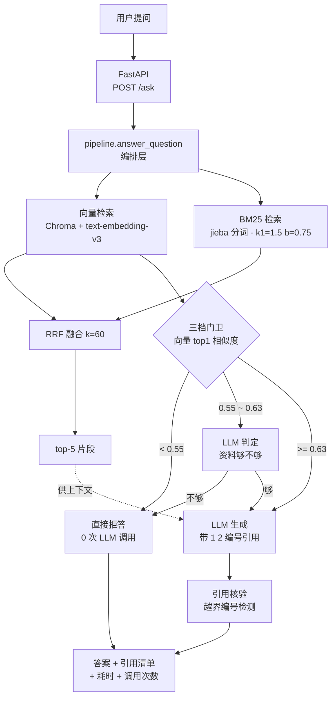

```mermaid
flowchart TD
    Q[用户提问] --> API[FastAPI<br/>POST /ask]
    API --> P[pipeline.answer_question<br/>编排层]

    P --> R1[向量检索<br/>Chroma + text-embedding-v3]
    P --> R2[BM25 检索<br/>jieba 分词 · k1=1.5 b=0.75]

    R1 --> F[RRF 融合 k=60]
    R2 --> F
    F --> TOP[top-5 片段]

    R1 --> G{三档门卫<br/>向量 top1 相似度}
    G -->|"&lt; 0.55"| REF[直接拒答<br/>0 次 LLM 调用]
    G -->|"0.55 ~ 0.63"| J[LLM 判定<br/>资料够不够]
    G -->|"&gt;= 0.63"| GEN[LLM 生成<br/>带 1 2 编号引用]

    J -->|不够| REF
    J -->|够| GEN

    GEN --> CK[引用核验<br/>越界编号检测]
    CK --> OUT[答案 + 引用清单<br/>+ 耗时 + 调用次数]
    REF --> OUT
    TOP -.供上下文.-> GEN
```